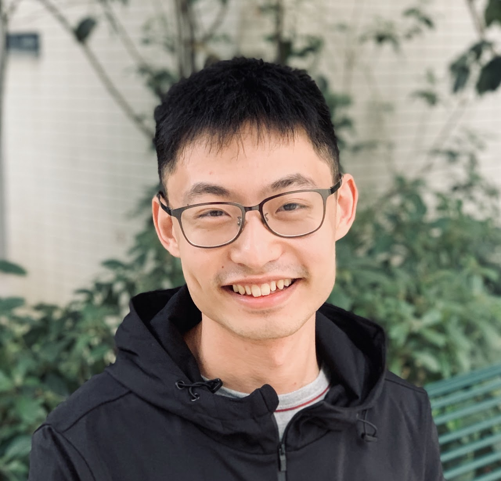

<a>

My name is Yihang Wang, a Schmidt AI in Science postdoctoral fellow at the University of Chicago. I received my PhD degree in Biophysics at the University of Maryland, College Park.

I have a general interest in studying complex systems. In particular, I hope my work can bring us new understanding to living systems. My current research focuses on the interface between statistical mechanics, machine learning, and molecular dynamics simulations. I am using ideas from these areas to explore the functional mechanisms of biomolecular systems. 

If you want to get in touch with me, feel free to [send me an email](mailto:yihangw@uchicago.edu).

   
